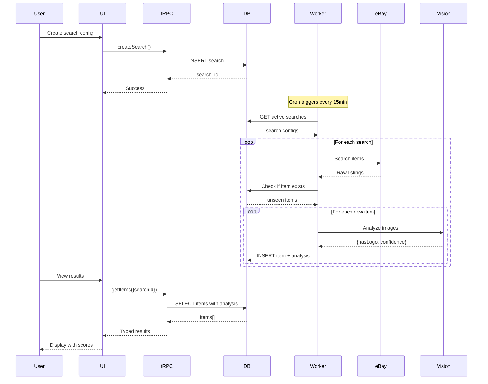

```mermaid
sequenceDiagram
    participant User
    participant UI
    participant tRPC
    participant DB
    participant Worker
    participant eBay
    participant Vision

    User->>UI: Create search config
    UI->>tRPC: createSearch()
    tRPC->>DB: INSERT search
    DB-->>tRPC: search_id
    tRPC-->>UI: Success
    
    Note over Worker: Cron triggers every 15min
    
    Worker->>DB: GET active searches
    DB-->>Worker: search configs
    
    loop For each search
        Worker->>eBay: Search items
        eBay-->>Worker: Raw listings
        
        Worker->>DB: Check if item exists
        DB-->>Worker: unseen items
        
        loop For each new item
            Worker->>Vision: Analyze images
            Vision-->>Worker: {hasLogo, confidence}
            Worker->>DB: INSERT item + analysis
        end
    end
    
    User->>UI: View results
    UI->>tRPC: getItems({searchId})
    tRPC->>DB: SELECT items with analysis
    DB-->>tRPC: items[]
    tRPC-->>UI: Typed results
    UI-->>User: Display with scores
```
