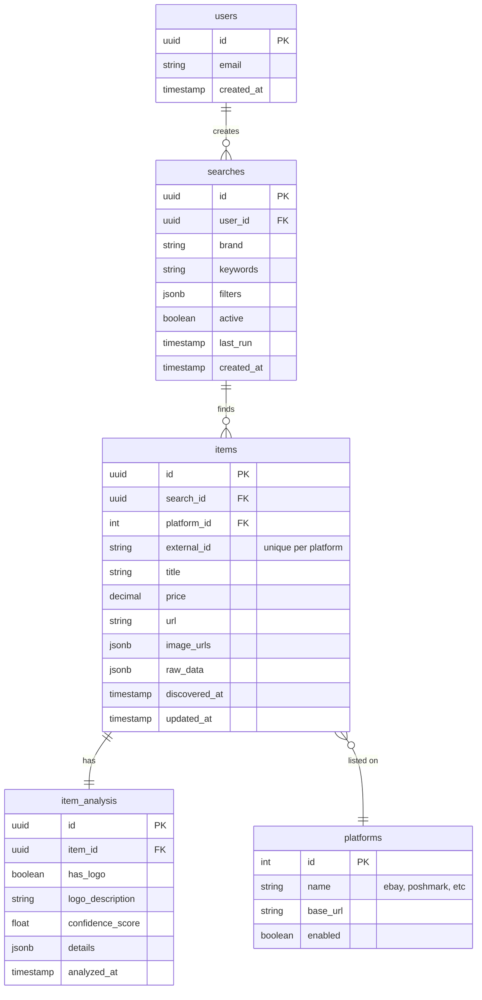

```mermaid
erDiagram
    users ||--o{ searches : creates
    searches ||--o{ items : finds
    items ||--|| item_analysis : has
    items }o--|| platforms : "listed on"
    
    users {
        uuid id PK
        string email
        timestamp created_at
    }
    
    searches {
        uuid id PK
        uuid user_id FK
        string brand
        string keywords
        jsonb filters
        boolean active
        timestamp last_run
        timestamp created_at
    }
    
    platforms {
        int id PK
        string name "ebay, poshmark, etc"
        string base_url
        boolean enabled
    }
    
    items {
        uuid id PK
        uuid search_id FK
        int platform_id FK
        string external_id "unique per platform"
        string title
        decimal price
        string url
        jsonb image_urls
        jsonb raw_data
        timestamp discovered_at
        timestamp updated_at
    }
    
    item_analysis {
        uuid id PK
        uuid item_id FK
        boolean has_logo
        string logo_description
        float confidence_score
        jsonb details
        timestamp analyzed_at
    }
```
