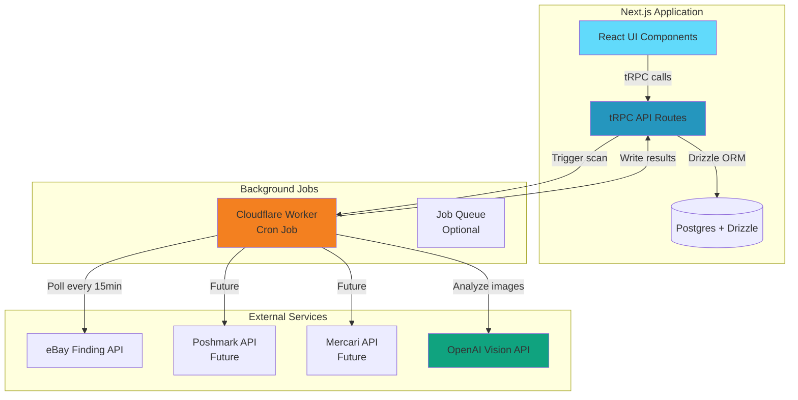

```mermaid
graph TB
    subgraph "Next.js Application"
        UI[React UI Components]
        API[tRPC API Routes]
        DB[(Postgres + Drizzle)]
    end
    
    subgraph "Background Jobs"
        Worker[Cloudflare Worker<br/>Cron Job]
        Queue[Job Queue<br/>Optional]
    end
    
    subgraph "External Services"
        eBay[eBay Finding API]
        Poshmark[Poshmark API<br/>Future]
        Mercari[Mercari API<br/>Future]
        Vision[OpenAI Vision API]
    end
    
    UI -->|tRPC calls| API
    API -->|Drizzle ORM| DB
    
    Worker -->|Poll every 15min| eBay
    Worker -->|Future| Poshmark
    Worker -->|Future| Mercari
    Worker -->|Analyze images| Vision
    Worker -->|Write results| API
    
    API -->|Trigger scan| Worker
    
    style UI fill:#61dafb
    style API fill:#2596be
    style Worker fill:#f38020
    style Vision fill:#10a37f
```
